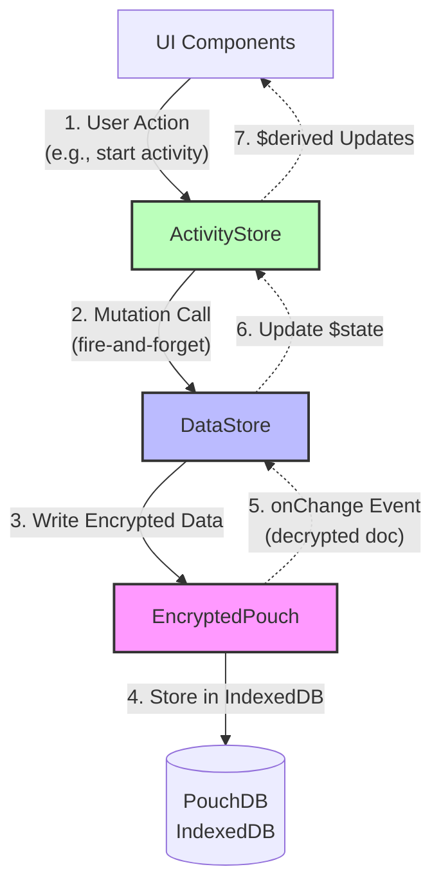

# TickyTock Architecture

## Overview

TickyTock is a privacy-first time tracking app built with Svelte 5, using a **fully reactive architecture** with encrypted local storage and optional sync.

## Core Principles

1. **Privacy First**: All data encrypted at rest using `@mrbelloc/encrypted-pouch`
2. **Offline First**: Works entirely offline, sync is optional
3. **Reactive**: Svelte 5 `$state` and `$derived` drive all UI updates
4. **Event-Driven**: Database changes flow through events, never polling

## Data Flow Architecture



## Layer Responsibilities

### 1. UI Components (src/components/)

- **What**: Svelte 5 components using runes (`$state`, `$derived`, `$effect`)
- **Reads**: Observe reactive state from ActivityStore
- **Writes**: Call ActivityStore mutation methods
- **Never**: Touch DataStore directly

**Example:**

```svelte
<script>
  import { getActivityStore } from '../lib/activityStore.svelte'
  const activityStore = getActivityStore()

  // Reactive - auto-updates when activities change
  let activities = $derived(activityStore.todayStats.activities)

  async function handleStop(id) {
    await activityStore.stopActivity(id) // Fire-and-forget
    // UI updates automatically via events
  }
</script>
```

### 2. ActivityStore (src/lib/activityStore.svelte.ts)

- **What**: High-level reactive store with computed stats
- **Reads**: From DataStore's `$state` arrays (reactive)
- **Writes**: Delegates to DataStore methods
- **Features**:
  - Pre-calculated stats (today, week, month)
  - Auto-updating every 10s for running activities
  - Smart date boundary detection
  - Recent tasks for quick-start

**Key Pattern:**

```typescript
class ActivityStore {
  // Reactive getters
  get activities(): ActivityDoc[] {
    return getDataStore().activities // Reads from $state
  }

  // Mutations (fire-and-forget)
  async createActivity(data): Promise<void> {
    await getDataStore().saveActivity(data)
    // No return value - events will update UI
  }
}
```

### 3. DataStore (src/lib/dataStore.svelte.ts)

- **What**: Low-level encrypted storage manager
- **State**: Svelte 5 `$state` arrays (in-memory plaintext)
- **Reads**: Synchronous from memory
- **Writes**: Async to EncryptedPouch, events update state

**Critical Pattern - Fire and Forget:**

```typescript
class DataStore {
  activities = $state<ActivityDoc[]>([])

  // Write: fire-and-forget
  async saveActivity(activity: Activity): Promise<void> {
    await this.store.put('activity', activity)
    // Events will update this.activities
  }

  // Events update state
  private handleChange(changes) {
    for (const doc of changes.docs) {
      this.activities.push(doc) // Updates $state
    }
  }
}
```

### 4. EncryptedPouch (@mrbelloc/encrypted-pouch)

- **What**: Wrapper around PouchDB with encryption/decryption
- **Encryption**: Plaintext in memory, encrypted on disk
- **Events**: Fires `onChange`, `onDelete`, `onSync`
- **Pattern**: Write encrypted → Read decrypted via events

**How it works:**

```typescript
const store = new EncryptedPouch(db, password, {
  onChange: (changes) => {
    // Receives DECRYPTED documents
    // Update your $state here
  },
})

// Write
await store.put('activity', { task: 'foo' })
// → Encrypts → Writes to PouchDB → Fires onChange with decrypted doc

// No direct read - only via events!
```

## Key Architecture Decisions

### ❌ Anti-Pattern: Returning Values from Mutations

**DON'T:**

```typescript
const doc = await dataStore.saveActivity(data)
// Waiting for return creates race conditions
```

**DO:**

```typescript
await dataStore.saveActivity(data)
// UI updates reactively via events
```

### ✅ Reactive Flow

1. **User clicks "Stop Activity"**
2. Component calls `activityStore.stopActivity(id)`
3. ActivityStore → DataStore → EncryptedPouch
4. EncryptedPouch encrypts & writes to PouchDB
5. EncryptedPouch fires `onChange` event with decrypted doc
6. DataStore updates `activities` array (`$state`)
7. ActivityStore's `$derived` recalculates stats
8. UI auto-updates (Svelte reactivity)

## State Management

### Global State

- **Auth State**: `auth.svelte.ts` - locked/unlocked
- **DataStore**: Singleton, one per session
- **ActivityStore**: Singleton, wraps DataStore
- **FilterStore**: UI filter state
- **ToastStore**: Notifications
- **ThemeStore**: App theming

### Component State

- **Local only**: Form inputs, UI toggles
- **Never duplicates** global state

## Sync Architecture

```
┌─────────────┐
│   Local DB  │
│  (PouchDB)  │
└──────┬──────┘
       │
       ├─── Continuous Sync ───┐
       │                       │
       ▼                       ▼
┌─────────────┐         ┌──────────────┐
│EncryptedPouch│◄──────►│  CouchDB     │
│   Events    │         │  (Remote)    │
└─────────────┘         └──────────────┘
       │
       ▼
   onChange
       │
       ▼
  $state Update
```

**Important**: Sync is optional and transparent. The app works fully offline.

## Testing Strategy

### Unit Tests

- **DataStore**: Event-driven updates
- **Utilities**: Pure functions (dateUtils, encryption)

### Pattern for Testing Reactive Code

```typescript
await dataStore.saveActivity(data)
await waitForUpdate() // Wait for events
expect(dataStore.activities).toHaveLength(1)
```

## File Structure

```
src/
├── lib/
│   ├── dataStore.svelte.ts      ← Low-level encrypted storage
│   ├── activityStore.svelte.ts  ← High-level reactive store
│   ├── auth.svelte.ts            ← Authentication state
│   ├── filterStore.svelte.ts    ← UI filter state
│   ├── toastStore.svelte.ts     ← Notifications
│   ├── themeStore.svelte.ts     ← Theme state
│   ├── types.ts                  ← TypeScript types
│   ├── settings.ts               ← Settings helpers
│   ├── accounts.ts               ← Multi-account management
│   └── dateUtils.ts              ← Date utilities
│
└── components/
    ├── MainView.svelte           ← Main app (when unlocked)
    ├── UnlockView.svelte         ← Login screen
    ├── ActivitiesView.svelte     ← Activity list
    ├── StatsView.svelte          ← Charts and statistics
    ├── SettingsView.svelte       ← Settings panel
    └── [forms and UI components]
```

## Common Gotchas for AI Agents

1. **Don't wait for mutation return values** - They return `void`
2. **Don't manually update `$state`** - Events do it
3. **Don't import `activities.svelte.ts`** - It was deleted (use `activityStore`)
4. **Don't use `onMount` for data loading** - Use `$derived`
5. **EncryptedPouch is event-driven** - No polling, no direct reads
6. **All data flows through events** - This is intentional, not a bug

## Performance Characteristics

- **Read**: O(1) - from memory
- **Write**: Async (encryption + IndexedDB)
- **Stats**: Pre-calculated, updated every 10s
- **Search**: In-memory linear scan (fast enough for personal use)

## Security Model

1. **Passphrase** unlocks database
2. **All data encrypted at rest** in IndexedDB
3. **Plaintext only in memory** during session
4. **Sync is encrypted** (CouchDB stores encrypted blobs)
5. **No server-side decryption** possible
